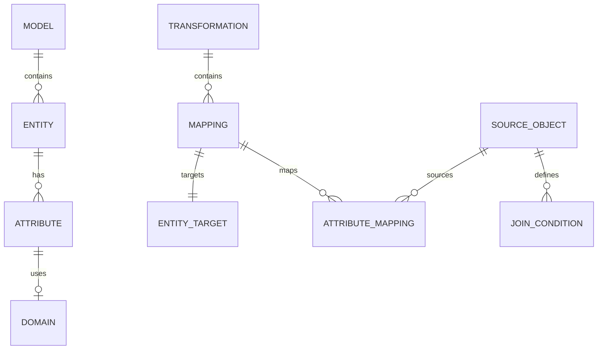
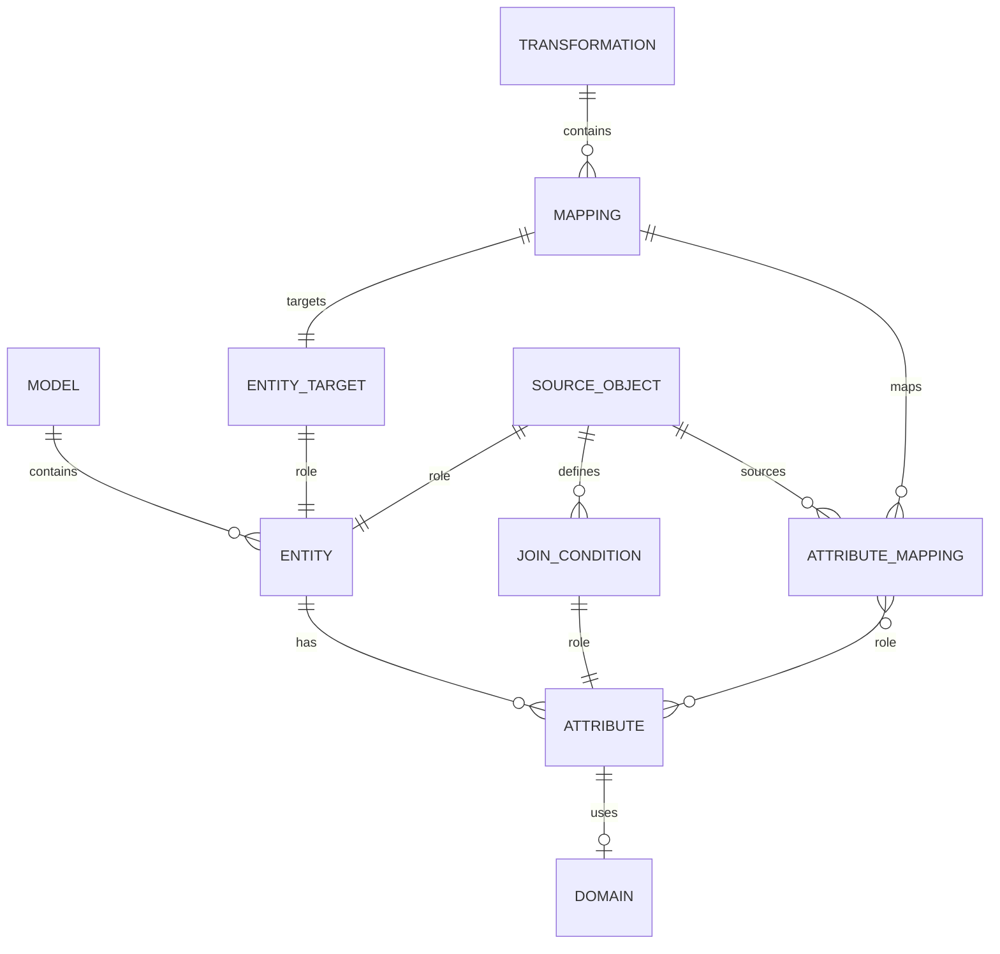
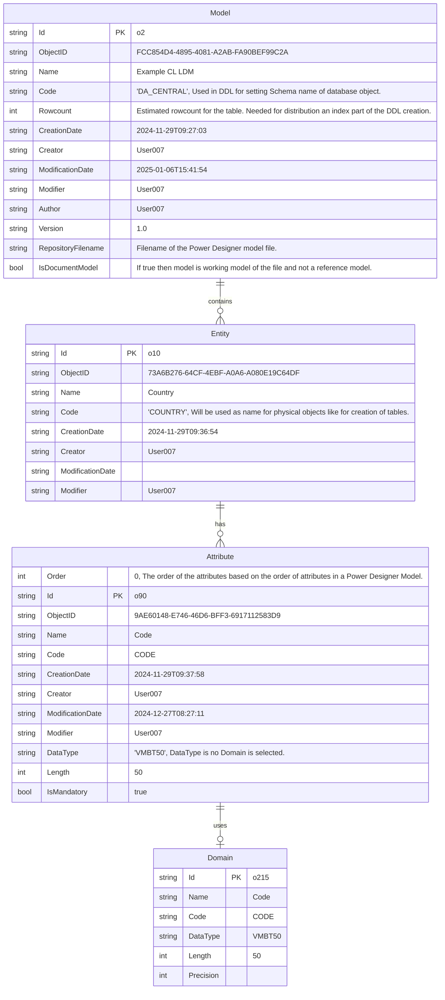
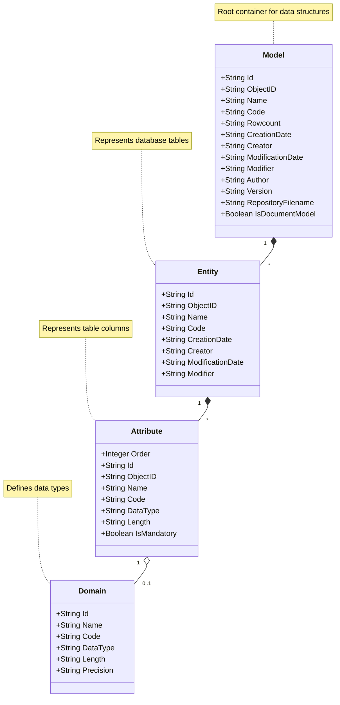
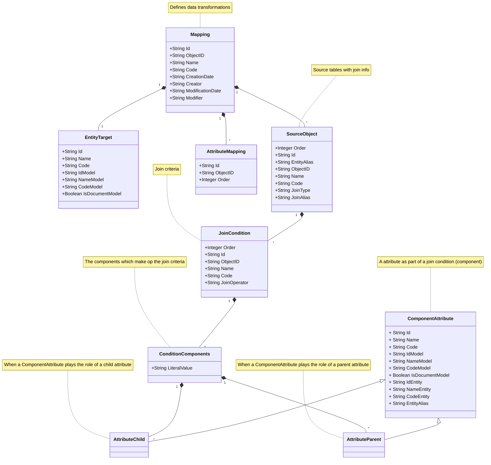

# Extracted Model from Power Designer

The result of using the pd_extractor module is a JSON representation of the model and the transformations involved to fill the model.

The model represents data structures, including models, entities, attributes, relationships, transformations, mappings, filters and functions.

The model also provides a structured way to define data elements and their transformations, including source objects, join conditions, and attribute mappings.

## Power Designer modelling functionality

Power Designer allows you to build data models. With the MDDE extension we specify how the model of a document is loaded. Below is described what what metadata on the data models is extracted and how the ETL/Transformations are extracted. Both models are represented in the JSON that results from the extraction.

### Model and Transformation representation in JSON

### Entity Relationship diagram

This section specifies how both above are related, and not so much how they are extracted into a JSON

## Class diagram for the JSON Model structure

### Model - ER Diagram version

### Model - Class Diagram version

## Class diagram for the Transformation structure

