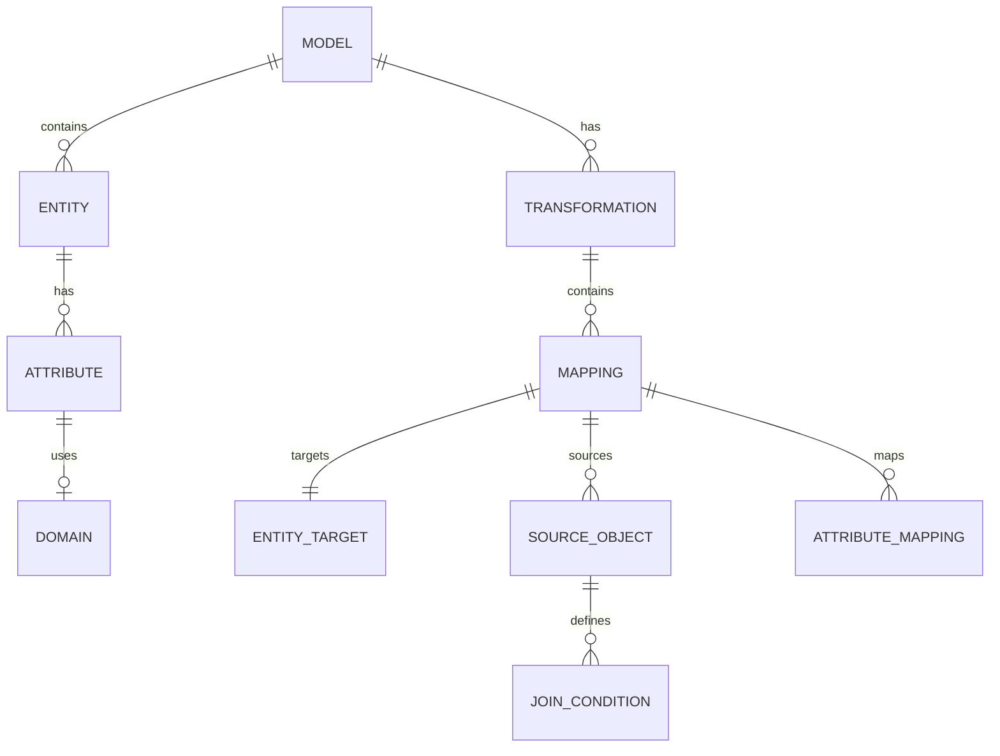
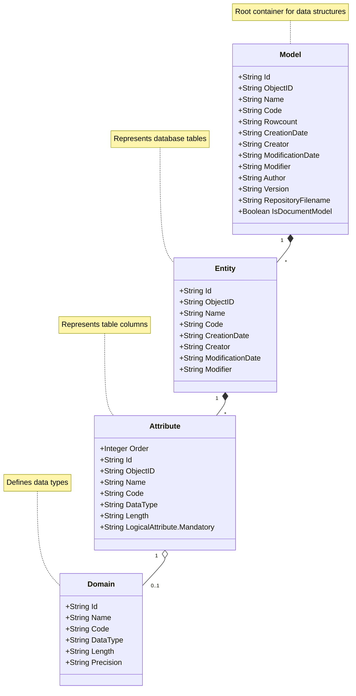
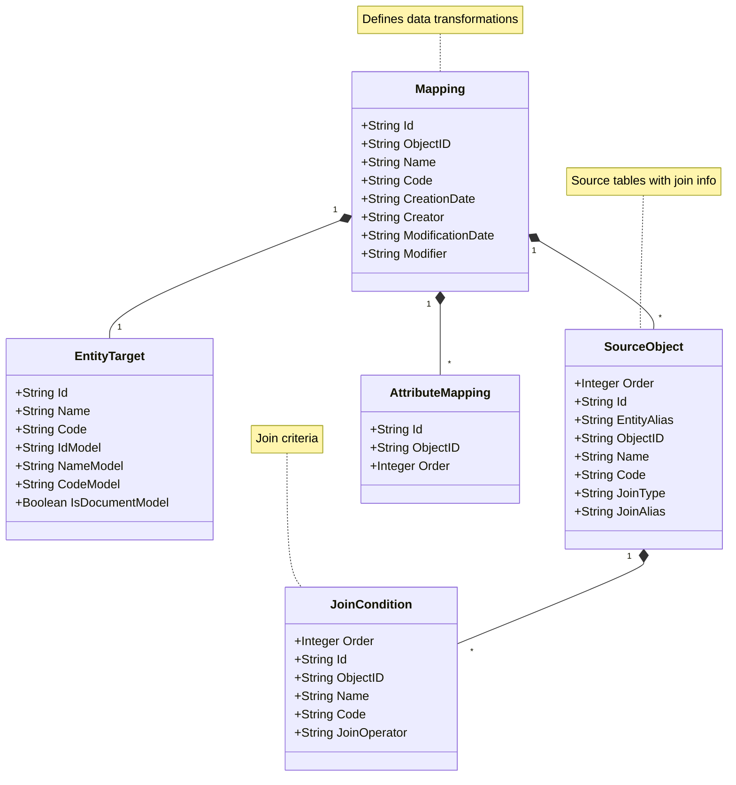

# Model

Comprehensive JSON model for representing data structures, including models, entities, attributes, relationships, transformations, mappings, filters, and functions. The model provides a structured way to define data elements and their transformations, including source objects, join conditions, and attribute mappings.

## Entity Relationship diagram for the JSON Model

## Class diagram for the JSON Model structure

## Class diagram for the Transformation structure

